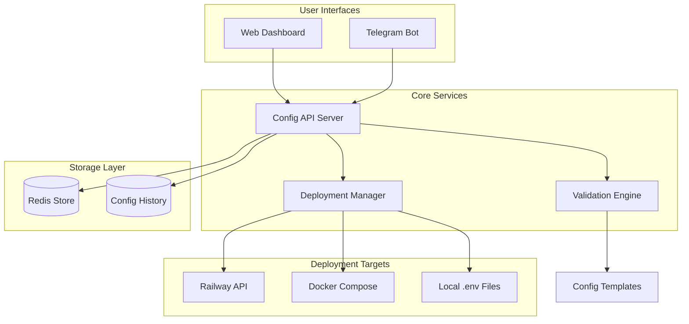

# Design Document: Centralized Configuration Management

## Overview

The Centralized Configuration Management system provides a unified interface for managing environment variables across distributed worker architecture components. The system consists of a web dashboard, extended Telegram bot commands, secure configuration storage, and automated deployment integration. It eliminates manual `.env` file management while providing validation, history tracking, and real-time deployment capabilities.

## Architecture



The system follows a layered architecture with clear separation between user interfaces, business logic, and deployment targets. The Config API Server acts as the central orchestrator, handling requests from both web and Telegram interfaces while coordinating validation, storage, and deployment operations.

## Components and Interfaces

### Config API Server
**Purpose**: Central HTTP API server handling all configuration operations
**Technology**: Express.js with TypeScript
**Key Responsibilities**:
- Authentication and authorization
- Request routing and validation
- Coordination between validation, storage, and deployment
- WebSocket support for real-time updates

**Interface**:
```typescript
interface ConfigAPIServer {
  // Environment management
  listEnvironments(): Promise<Environment[]>
  createEnvironment(name: string, template?: string): Promise<Environment>
  
  // Configuration operations
  getConfig(envId: string, componentId?: string): Promise<ConfigSet>
  updateConfig(envId: string, componentId: string, changes: ConfigChange[]): Promise<void>
  deployConfig(envId: string, componentIds?: string[]): Promise<DeploymentResult>
  
  // History and rollback
  getConfigHistory(envId: string, componentId: string): Promise<ConfigHistory[]>
  rollbackConfig(envId: string, componentId: string, versionId: string): Promise<void>
}
```

### Web Dashboard
**Purpose**: React-based administrative interface for visual configuration management
**Technology**: React with Material-UI, WebSocket for real-time updates
**Key Features**:
- Environment and component selection
- Configuration editing with validation feedback
- Deployment status monitoring
- History visualization and rollback interface

**Interface Components**:
```typescript
interface WebDashboard {
  EnvironmentSelector: React.Component
  ConfigEditor: React.Component<{environment: string, component: string}>
  DeploymentMonitor: React.Component
  HistoryViewer: React.Component
  ValidationFeedback: React.Component
}
```

### Telegram Bot Extension
**Purpose**: Command-line interface through existing Telegram bot
**Integration**: Extends existing `telegramHandler.js` with new commands
**Commands**:
- `/config list` - Show environments and components
- `/config get <env> <component>` - Display current configuration
- `/config set <env> <component> <key> <value>` - Update single value
- `/config deploy <env>` - Trigger deployment
- `/config history <env> <component>` - Show change history
- `/config rollback <env> <component> <version>` - Rollback to previous version

### Validation Engine
**Purpose**: Template-based configuration validation and type checking
**Technology**: Joi schema validation with custom validators
**Key Features**:
- Component-specific validation templates
- Type checking (string, number, boolean, URL, etc.)
- Required field validation
- Custom format validators (e.g., Redis URLs, API keys)

**Interface**:
```typescript
interface ValidationEngine {
  validateConfig(componentType: string, config: ConfigSet): ValidationResult
  loadTemplate(componentType: string): ConfigTemplate
  validateSingleValue(key: string, value: string, template: ConfigTemplate): boolean
}

interface ConfigTemplate {
  [key: string]: {
    type: 'string' | 'number' | 'boolean' | 'url' | 'email'
    required: boolean
    sensitive: boolean
    default?: string
    pattern?: RegExp
    description: string
  }
}
```

### Deployment Manager
**Purpose**: Automated deployment to various target platforms
**Key Features**:
- Railway API integration for cloud deployments
- Docker Compose environment variable updates
- Local `.env` file generation
- Deployment status tracking and rollback support

**Interface**:
```typescript
interface DeploymentManager {
  deployToRailway(projectId: string, envId: string, config: ConfigSet): Promise<DeploymentResult>
  deployToDocker(composeFile: string, config: ConfigSet): Promise<DeploymentResult>
  deployToLocal(envFile: string, config: ConfigSet): Promise<DeploymentResult>
  
  getDeploymentStatus(deploymentId: string): Promise<DeploymentStatus>
  rollbackDeployment(deploymentId: string): Promise<void>
}
```

### Secure Storage Layer
**Purpose**: Encrypted storage of configuration data with history tracking
**Technology**: Redis with encryption for sensitive values
**Key Features**:
- AES-256 encryption for sensitive configuration values
- Versioned storage with automatic history retention
- Efficient batch operations for large configuration sets
- TTL-based cleanup of old versions

## Data Models

### Environment
```typescript
interface Environment {
  id: string
  name: string // dev, staging, prod
  description: string
  components: Component[]
  createdAt: Date
  updatedAt: Date
}
```

### Component
```typescript
interface Component {
  id: string
  name: string // coordinator, worker, pow-service
  type: ComponentType
  config: ConfigSet
  template: ConfigTemplate
}

enum ComponentType {
  COORDINATOR = 'coordinator',
  WORKER = 'worker',
  POW_SERVICE = 'pow-service',
  SHARED = 'shared'
}
```

### Configuration Set
```typescript
interface ConfigSet {
  [key: string]: ConfigValue
}

interface ConfigValue {
  value: string
  sensitive: boolean
  encrypted?: boolean
  lastModified: Date
  modifiedBy: string
}
```

### Configuration History
```typescript
interface ConfigHistory {
  id: string
  environmentId: string
  componentId: string
  changes: ConfigChange[]
  timestamp: Date
  userId: string
  deploymentId?: string
}

interface ConfigChange {
  key: string
  oldValue?: string
  newValue: string
  operation: 'create' | 'update' | 'delete'
}
```

### Deployment Result
```typescript
interface DeploymentResult {
  id: string
  status: 'pending' | 'success' | 'failed' | 'rolled_back'
  target: DeploymentTarget
  startedAt: Date
  completedAt?: Date
  error?: string
  affectedServices: string[]
}

interface DeploymentTarget {
  type: 'railway' | 'docker' | 'local'
  identifier: string // project ID, compose file path, etc.
}
```

## Correctness Properties

*A property is a characteristic or behavior that should hold true across all valid executions of a system-essentially, a formal statement about what the system should do. Properties serve as the bridge between human-readable specifications and machine-verifiable correctness guarantees.*

Based on the prework analysis, I've identified several key properties that need to be validated through property-based testing. After reviewing for redundancy, I've consolidated related properties to ensure each provides unique validation value.

### Property Reflection

Several properties were identified as potentially redundant:
- Properties about logging behavior (1.5, 4.5) can be combined into a comprehensive logging property
- Properties about validation behavior (3.2, 3.3, 3.5) can be consolidated into a single validation property
- Properties about deployment behavior (5.2, 5.5) can be combined into a comprehensive deployment property
- Properties about masking sensitive data (1.2, 2.2, 4.4) can be unified into one masking property

### Core Properties

**Property 1: Configuration validation consistency**
*For any* configuration update across any component and environment, the validation engine should apply the same template rules and either accept valid configurations or reject invalid ones with descriptive error messages
**Validates: Requirements 3.2, 3.3, 3.5**

**Property 2: Sensitive data masking universality**
*For any* configuration display operation (web interface, Telegram bot, or API response), all values marked as sensitive should be masked by default regardless of the interface used
**Validates: Requirements 1.2, 2.2, 4.4**

**Property 3: Configuration change logging completeness**
*For any* configuration modification operation, the system should create a log entry containing timestamp, user identification, and change details, regardless of the interface used (web or Telegram)
**Validates: Requirements 1.5, 4.5**

**Property 4: Deployment target identification accuracy**
*For any* configuration change, the deployment manager should correctly identify all affected deployment targets based on the component and environment configuration
**Validates: Requirements 5.1**

**Property 5: Deployment verification and notification consistency**
*For any* completed deployment operation, the system should verify the changes were applied successfully and send appropriate notifications to users regardless of the deployment target type
**Validates: Requirements 5.2, 5.5**

**Property 6: Configuration history preservation**
*For any* configuration change, the system should store the previous version with complete metadata before applying the new configuration, enabling accurate rollback operations
**Validates: Requirements 6.1**

**Property 7: Environment isolation integrity**
*For any* configuration operation within a specific environment, changes should not affect configurations in other environments, maintaining strict environment separation
**Validates: Requirements 7.1**

**Property 8: Rollback operation completeness**
*For any* valid rollback request, the system should restore the selected configuration version and automatically trigger deployment to apply the restored configuration
**Validates: Requirements 6.3, 6.4**

**Property 9: Template initialization consistency**
*For any* new environment creation, the system should initialize all component configurations with appropriate default values from their respective templates
**Validates: Requirements 3.4**

**Property 10: Access control enforcement universality**
*For any* configuration access attempt, the system should authenticate and authorize the user based on their role before allowing access to configuration data
**Validates: Requirements 4.3**

**Property 11: Encryption application consistency**
*For any* configuration value marked as sensitive, the system should encrypt it before storage using strong encryption algorithms
**Validates: Requirements 4.1**

**Property 12: Telegram command processing consistency**
*For any* valid Telegram configuration command, the system should process it without interfering with existing bot functionality and return appropriate confirmation messages
**Validates: Requirements 2.3, 2.4, 2.5, 8.2**

**Property 13: Backward compatibility preservation**
*For any* existing `.env` file format operation, the system should maintain compatibility while providing enhanced configuration management features
**Validates: Requirements 8.4**

**Property 14: Integration failure resilience**
*For any* failure at integration points (Redis, Railway API, Docker), the system should handle the failure gracefully and maintain overall system stability
**Validates: Requirements 8.5**

## Error Handling

The system implements comprehensive error handling across all layers:

### Validation Errors
- **Template Validation**: Missing required fields, invalid data types, format violations
- **Business Logic**: Circular dependencies, conflicting configurations, invalid environment states
- **User Input**: Malformed commands, unauthorized access attempts, invalid parameter combinations

### Integration Errors
- **Redis Connection**: Connection timeouts, authentication failures, data corruption
- **Railway API**: Rate limiting, authentication errors, service unavailability
- **Docker Integration**: Container runtime errors, file system permissions, network connectivity
- **Telegram API**: Message delivery failures, rate limiting, bot token issues

### Recovery Strategies
- **Graceful Degradation**: Continue operation with reduced functionality when external services fail
- **Automatic Retry**: Exponential backoff for transient failures with configurable retry limits
- **Circuit Breaker**: Prevent cascade failures by temporarily disabling failing integrations
- **Rollback Capability**: Automatic rollback to previous working configuration on deployment failures

### Error Reporting
- **Structured Logging**: All errors logged with context, correlation IDs, and stack traces
- **User Notifications**: Clear, actionable error messages through appropriate channels
- **Monitoring Integration**: Error metrics and alerts for operational visibility

## Testing Strategy

The testing strategy employs a dual approach combining unit tests for specific scenarios and property-based tests for comprehensive validation:

### Property-Based Testing
- **Framework**: fast-check for JavaScript/TypeScript property-based testing
- **Configuration**: Minimum 100 iterations per property test to ensure thorough coverage
- **Test Organization**: Each correctness property implemented as a separate property-based test
- **Tagging**: Each test tagged with format: **Feature: centralized-config-management, Property {number}: {property_text}**

### Unit Testing
- **Specific Examples**: Test concrete scenarios like specific Telegram commands, API endpoints
- **Edge Cases**: Empty configurations, maximum size limits, special characters in values
- **Integration Points**: Redis connection handling, Railway API responses, Docker command execution
- **Error Conditions**: Invalid inputs, network failures, authentication errors

### Test Data Generation
- **Smart Generators**: Generate realistic configuration data within valid input spaces
- **Environment Simulation**: Create test environments with various component combinations
- **User Role Simulation**: Generate different user types with varying permission levels
- **Deployment Target Variation**: Test across Railway, Docker, and local deployment scenarios

### Testing Infrastructure
- **Test Isolation**: Each test runs with clean Redis instance and isolated file system
- **Mock Services**: Mock external APIs (Railway, Docker) for reliable testing
- **Test Databases**: Separate Redis instances for testing to prevent data contamination
- **Continuous Integration**: Automated test execution on all code changes

The combination of property-based and unit testing ensures both broad coverage of input spaces and specific validation of critical functionality, providing confidence in system correctness and reliability.

Now I need to use the prework tool to analyze the acceptance criteria before writing the correctness properties:

<function_calls>
<invoke name="prework">
<parameter name="featureName">centralized-config-management