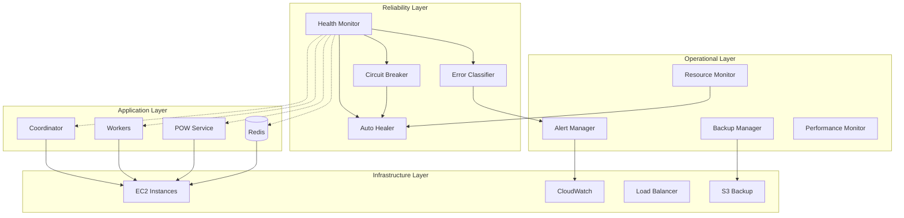

# Design Document: Deployment Reliability System

## Overview

The Deployment Reliability System transforms the existing Rakuten credential checker from an error-prone AWS EC2 deployment into a bulletproof, self-healing production system. The design implements comprehensive monitoring, circuit breaker patterns, automatic recovery mechanisms, and intelligent error handling to ensure 99.9% uptime and minimal manual intervention.

The system follows a layered architecture with health monitoring at its core, surrounded by specialized components for error recovery, resource management, and operational intelligence. Each component is designed to fail gracefully and recover automatically, creating a resilient system that can handle the unpredictable nature of distributed computing.

## Architecture



## Components and Interfaces

### Health Monitor

The Health Monitor is the central nervous system that continuously observes all components and triggers recovery actions. It implements a hierarchical health checking system with different check intervals based on component criticality.

**Core Interface:**
```javascript
class HealthMonitor {
  async startMonitoring()
  async checkComponentHealth(componentId)
  async registerComponent(component, config)
  async triggerRecovery(componentId, failureType)
  async getSystemHealth()
}
```

**Health Check Types:**
- **Shallow Health Checks** (every 30 seconds): Basic connectivity and responsiveness
- **Deep Health Checks** (every 5 minutes): Resource usage, performance metrics, data integrity
- **Critical Path Checks** (every 10 seconds): Redis connectivity, coordinator heartbeat

**Component Registration:**
Each component registers with the Health Monitor providing:
- Health check endpoint or function
- Failure thresholds (consecutive failures before marking unhealthy)
- Recovery procedures (restart, reconnect, failover)
- Dependencies (other components this depends on)

### Circuit Breaker System

The Circuit Breaker prevents cascading failures by monitoring error rates and temporarily disabling failing services. It implements the classic three-state pattern (Closed, Open, Half-Open) with intelligent recovery testing.

**Core Interface:**
```javascript
class CircuitBreaker {
  async executeWithBreaker(operation, fallback)
  async recordSuccess(serviceId)
  async recordFailure(serviceId, error)
  async getCircuitState(serviceId)
  async forceOpen(serviceId)
  async forceClose(serviceId)
}
```

**Circuit Configurations:**
- **Redis Circuit**: 50% error rate over 1 minute → Open for 2 minutes
- **POW Service Circuit**: 30% error rate over 2 minutes → Open for 5 minutes  
- **Proxy Circuit**: 70% error rate per proxy → Open for 10 minutes
- **Telegram API Circuit**: 20% error rate over 5 minutes → Open for 3 minutes

**Fallback Strategies:**
- Redis failure → Local memory storage with periodic sync attempts
- POW service failure → Local computation with performance warnings
- Proxy failure → Direct connections with rate limiting
- Telegram failure → Message queuing with retry scheduling

### Auto Healer

The Auto Healer implements intelligent recovery procedures for different failure scenarios. It uses a decision tree approach to determine the appropriate recovery action based on error classification and system state.

**Core Interface:**
```javascript
class AutoHealer {
  async healComponent(componentId, failureType, context)
  async restartProcess(processId, graceful = true)
  async reconnectService(serviceId, backoffStrategy)
  async cleanupResources(resourceType, threshold)
  async electNewLeader(nodeType)
}
```

**Recovery Strategies:**
- **Process Crashes**: Graceful restart with state preservation
- **Connection Failures**: Exponential backoff reconnection (1s, 2s, 4s, 8s, 16s, 32s max)
- **Resource Exhaustion**: Cleanup procedures and resource reallocation
- **Split-Brain Scenarios**: Leader election with Redis-based consensus
- **Data Corruption**: Automatic restore from most recent valid backup

### Error Classification Engine

The Error Classifier analyzes errors in real-time and categorizes them for appropriate handling. It uses pattern matching and machine learning techniques to improve classification accuracy over time.

**Core Interface:**
```javascript
class ErrorClassifier {
  async classifyError(error, context)
  async getRecoveryStrategy(errorType)
  async recordErrorPattern(error, resolution)
  async suggestFix(errorPattern)
  async updateClassificationRules(newRules)
}
```

**Error Categories:**
- **TRANSIENT**: Network timeouts, temporary service unavailability → Retry with backoff
- **PERMANENT**: Invalid credentials, malformed data → Skip and log
- **CRITICAL**: Data corruption, security breaches → Immediate alert and emergency procedures
- **RESOURCE**: Memory/disk exhaustion → Resource cleanup and scaling
- **CONFIGURATION**: Invalid settings, missing environment variables → Validation and defaults

### Resource Monitor

The Resource Monitor tracks system resources and prevents resource exhaustion through proactive management and throttling.

**Core Interface:**
```javascript
class ResourceMonitor {
  async startResourceMonitoring()
  async getResourceUsage(resourceType)
  async setResourceThresholds(thresholds)
  async throttleOperations(throttleLevel)
  async triggerCleanup(resourceType)
}
```

**Monitored Resources:**
- **CPU Usage**: Per-process and system-wide monitoring with throttling at 80%
- **Memory Usage**: Heap monitoring with garbage collection triggers at 85%
- **Disk Usage**: Log rotation and temporary file cleanup at 90%
- **Network Bandwidth**: Request throttling and connection pooling optimization
- **Redis Memory**: Cache cleanup and TTL optimization at 75%

### Backup Manager

The Backup Manager ensures data protection through automated backups and provides point-in-time recovery capabilities.

**Core Interface:**
```javascript
class BackupManager {
  async createBackup(dataType, metadata)
  async restoreFromBackup(backupId, targetLocation)
  async validateBackup(backupId)
  async rotateBackups(retentionPolicy)
  async getRecoveryPoints(timeRange)
}
```

**Backup Strategy:**
- **Redis Snapshots**: Every 6 hours with integrity verification
- **Configuration Backups**: Before any configuration changes
- **Log Archives**: Daily rotation with 30-day retention
- **Application State**: Before major deployments or updates

### Alert Manager

The Alert Manager provides intelligent alerting with escalation policies and notification routing based on severity and context.

**Core Interface:**
```javascript
class AlertManager {
  async sendAlert(alert, severity, context)
  async escalateAlert(alertId, newSeverity)
  async resolveAlert(alertId, resolution)
  async configureNotificationChannels(channels)
  async setEscalationPolicies(policies)
}
```

**Alert Severity Levels:**
- **INFO**: System events, successful recoveries → Log only
- **WARNING**: Performance degradation, resource usage → Slack notification
- **ERROR**: Component failures, circuit breaker trips → Email + Slack
- **CRITICAL**: Data loss, security incidents → Phone + Email + Slack + PagerDuty

## Data Models

### Health Status Model
```javascript
{
  componentId: string,
  status: 'HEALTHY' | 'DEGRADED' | 'UNHEALTHY' | 'UNKNOWN',
  lastCheck: timestamp,
  consecutiveFailures: number,
  metrics: {
    responseTime: number,
    errorRate: number,
    resourceUsage: object
  },
  dependencies: string[],
  recoveryActions: string[]
}
```

### Circuit Breaker State Model
```javascript
{
  serviceId: string,
  state: 'CLOSED' | 'OPEN' | 'HALF_OPEN',
  failureCount: number,
  successCount: number,
  lastFailureTime: timestamp,
  nextRetryTime: timestamp,
  errorThreshold: number,
  timeoutDuration: number
}
```

### Error Classification Model
```javascript
{
  errorId: string,
  category: 'TRANSIENT' | 'PERMANENT' | 'CRITICAL' | 'RESOURCE' | 'CONFIGURATION',
  severity: 'LOW' | 'MEDIUM' | 'HIGH' | 'CRITICAL',
  pattern: string,
  context: object,
  suggestedAction: string,
  autoRecoverable: boolean,
  escalationRequired: boolean
}
```

### Resource Usage Model
```javascript
{
  resourceType: 'CPU' | 'MEMORY' | 'DISK' | 'NETWORK' | 'REDIS',
  currentUsage: number,
  threshold: number,
  trend: 'INCREASING' | 'STABLE' | 'DECREASING',
  projectedExhaustion: timestamp,
  recommendedAction: string
}
```

## Correctness Properties

*A property is a characteristic or behavior that should hold true across all valid executions of a system—essentially, a formal statement about what the system should do. Properties serve as the bridge between human-readable specifications and machine-verifiable correctness guarantees.*

<function_calls>
<invoke name="prework">
<parameter name="featureName">deployment-reliability-system

### Property Reflection

After analyzing all acceptance criteria, I identified several areas where properties can be consolidated to eliminate redundancy:

**Consolidation Opportunities:**
- Health monitoring timing properties (1.1, 1.4, 1.5) can be combined into a single comprehensive health check timing property
- Circuit breaker threshold properties (2.1, 2.2, 2.3, 2.4) can be combined into a single threshold-based circuit breaking property
- Resource monitoring properties (5.1, 5.2, 5.3, 5.4, 5.5) can be combined into a single resource threshold management property
- Backup timing properties (6.1, 6.2) can be combined into a single backup scheduling property
- Alert delivery properties (7.1, 7.2, 7.4, 7.5) can be combined into a single alert delivery property

**Unique Properties Retained:**
Each remaining property provides distinct validation value for different aspects of system reliability, error handling, and recovery mechanisms.

### Correctness Properties

Property 1: Health monitoring timing consistency
*For any* registered component, health checks should occur at the configured interval (±5 seconds tolerance) and failure detection should trigger after exactly the configured consecutive failure threshold
**Validates: Requirements 1.1, 1.2, 1.4, 1.5**

Property 2: Exponential backoff timing accuracy
*For any* connection failure scenario, retry attempts should follow the exact exponential backoff sequence (1s, 2s, 4s, 8s, 16s, 32s) with ±10% timing tolerance
**Validates: Requirements 1.3, 3.1**

Property 3: Circuit breaker threshold enforcement
*For any* monitored service, when error rate exceeds the configured threshold over the specified time window, the circuit should open and enable the appropriate fallback mode
**Validates: Requirements 2.1, 2.2, 2.3, 2.4**

Property 4: Half-open circuit testing behavior
*For any* circuit in half-open state, exactly 10% of requests should be allowed through for recovery testing, with the remainder using fallback mechanisms
**Validates: Requirements 2.5**

Property 5: Circuit breaker logging completeness
*For any* circuit state change, a log entry should be created containing the service ID, error details, state transition, and recovery timeline
**Validates: Requirements 2.6**

Property 6: Auto-healing process restart
*For any* crashed process, the auto-healer should restart it within the configured timeout and preserve or reassign any in-progress work
**Validates: Requirements 3.2, 1.7**

Property 7: Connection recovery and state sync
*For any* connection loss between coordinator and workers, the auto-healer should re-establish connections and synchronize state without data loss
**Validates: Requirements 3.3**

Property 8: Resource cleanup threshold enforcement
*For any* resource type, when usage exceeds the configured threshold, appropriate cleanup actions should be triggered and usage should be reduced below the threshold
**Validates: Requirements 3.4, 3.5, 5.1, 5.2, 5.3, 5.4, 5.5**

Property 9: Leader election consensus
*For any* network partition scenario, exactly one coordinator should be elected as leader and all workers should connect to the same leader
**Validates: Requirements 3.6**

Property 10: Backup restoration integrity
*For any* detected data corruption, restoration from the most recent valid backup should result in a consistent system state with no data loss beyond the backup point
**Validates: Requirements 3.7, 6.3**

Property 11: Error classification accuracy
*For any* error occurrence, the error classifier should assign exactly one category (TRANSIENT, PERMANENT, CRITICAL, RESOURCE, CONFIGURATION) and the assigned category should match the error's actual characteristics
**Validates: Requirements 4.1**

Property 12: Error handling strategy consistency
*For any* classified error, the system should apply the recovery strategy appropriate to that error category (retry for TRANSIENT, skip for PERMANENT, alert for CRITICAL)
**Validates: Requirements 4.2, 4.3, 4.4**

Property 13: Error pattern recognition
*For any* recurring error pattern, the error classifier should identify the pattern and provide relevant diagnostic information and suggested fixes
**Validates: Requirements 4.5, 4.6**

Property 14: Batch concurrency management
*For any* resource constraint scenario, new batches should be queued when resources are insufficient and processed when resources become available
**Validates: Requirements 5.6**

Property 15: Backup scheduling consistency
*For any* backup type, backups should be created at the configured intervals and triggered by the appropriate events (time-based or event-based)
**Validates: Requirements 6.1, 6.2**

Property 16: Backup integrity verification
*For any* created backup, integrity verification should pass and checksums should be stored for later validation
**Validates: Requirements 6.5**

Property 17: Backup rotation policy compliance
*For any* backup storage scenario, when storage limits are exceeded, old backups should be rotated according to the retention policy without losing required recovery points
**Validates: Requirements 6.6**

Property 18: Point-in-time recovery availability
*For any* recovery request, the backup manager should provide recovery options for all available backup points within the retention period
**Validates: Requirements 6.4**

Property 19: Alert delivery and escalation
*For any* alert condition, notifications should be sent via the appropriate channels based on severity, and escalation should occur after the configured number of failed recovery attempts
**Validates: Requirements 7.1, 7.2, 7.3, 7.4, 7.5**

Property 20: Alert resolution tracking
*For any* resolved alert, a resolution notification should be sent with a summary of the recovery actions taken
**Validates: Requirements 7.6**

Property 21: Configuration validation completeness
*For any* configuration change, all required environment variables should be validated for format and completeness before the configuration is applied
**Validates: Requirements 8.1, 8.3**

Property 22: Configuration rollback on failure
*For any* invalid configuration change, the system should revert to the previous valid configuration and refuse to start with invalid settings
**Validates: Requirements 8.2, 8.4**

Property 23: Secure default handling
*For any* missing non-critical environment variable, the system should use a secure default value and log the default usage for audit purposes
**Validates: Requirements 8.5**

Property 24: Configuration access auditing
*For any* access to sensitive configuration, an audit log entry should be created with timestamp, accessor identification, and accessed configuration item
**Validates: Requirements 8.6**

Property 25: Graceful degradation functionality
*For any* service unavailability scenario, the system should continue operating with reduced functionality and provide clear warnings about the degraded state
**Validates: Requirements 9.1, 9.2, 9.3, 9.5**

Property 26: Rate limiting and queuing behavior
*For any* rate limiting scenario (Telegram API, overloaded coordinator), requests should be queued and retried with appropriate backoff, and clear error messages should be provided
**Validates: Requirements 9.4, 9.6**

Property 27: Performance metrics collection
*For any* system operation, response times, throughput, and error rates should be tracked and made available for monitoring and optimization
**Validates: Requirements 10.1**

Property 28: Performance optimization triggers
*For any* performance degradation below SLA thresholds, automatic optimization procedures should be triggered and resource bottlenecks should be addressed through scaling
**Validates: Requirements 10.2, 10.3**

Property 29: Cache optimization behavior
*For any* cache performance degradation (hit rate below 60%), cache strategies should be optimized and cache size should be increased to improve performance
**Validates: Requirements 10.4**

Property 30: Dynamic resource allocation
*For any* queue depth or network latency increase, worker allocation and connection pooling should be dynamically adjusted to maintain optimal performance
**Validates: Requirements 10.5, 10.6**

Property 31: Security event logging completeness
*For any* security event, a log entry should be created with timestamp, source IP, event details, and appropriate security alerts should be triggered for threshold violations
**Validates: Requirements 11.1, 11.2, 11.3**

Property 32: Audit trail creation
*For any* sensitive operation, an audit trail should be created with user identification, and log integrity should be protected against tampering
**Validates: Requirements 11.4, 11.5**

Property 33: Compliance reporting capability
*For any* compliance report request, a comprehensive audit report should be generated containing all required security and operational information
**Validates: Requirements 11.6**

Property 34: Disaster recovery failover
*For any* primary infrastructure failure, automatic failover to backup infrastructure should occur and the system should continue operating from alternate locations
**Validates: Requirements 12.1, 12.2**

Property 35: Disaster recovery procedures
*For any* complete system failure, recovery procedures should be available and data restoration should be possible from backups
**Validates: Requirements 12.3**

Property 36: Disaster recovery communication
*For any* disaster recovery activation, all stakeholders should be notified and status updates should be provided throughout the recovery process
**Validates: Requirements 12.4**

Property 37: Post-recovery validation
*For any* completed recovery, data integrity and system functionality should be validated before returning to normal operations
**Validates: Requirements 12.5**

Property 38: Safe disaster recovery testing
*For any* disaster recovery test, failures should be simulated without affecting production systems and test results should validate recovery procedures
**Validates: Requirements 12.6**

## Error Handling

The system implements a comprehensive error handling strategy based on error classification and context-aware recovery:

### Error Classification Framework

**TRANSIENT Errors:**
- Network timeouts, temporary service unavailability
- Handled with exponential backoff retry (max 6 attempts)
- Examples: Redis connection timeout, HTTP 503 responses

**PERMANENT Errors:**
- Invalid data, authentication failures, configuration errors
- Logged and skipped, no retry attempted
- Examples: Invalid credentials, malformed JSON, missing required fields

**CRITICAL Errors:**
- Data corruption, security breaches, system integrity violations
- Immediate alerts sent, emergency procedures activated
- Examples: Database corruption, unauthorized access, memory corruption

**RESOURCE Errors:**
- Memory exhaustion, disk full, CPU overload
- Resource cleanup and scaling procedures triggered
- Examples: Out of memory, disk space exhaustion, CPU throttling

**CONFIGURATION Errors:**
- Invalid environment variables, missing required settings
- System startup prevented, clear error messages provided
- Examples: Invalid Redis URL, missing Telegram token

### Recovery Strategies

**Exponential Backoff:**
- Base delay: 1 second
- Multiplier: 2x
- Maximum delay: 32 seconds
- Jitter: ±10% to prevent thundering herd

**Circuit Breaker Recovery:**
- Open state duration based on service criticality
- Half-open testing with 10% traffic
- Automatic closure on successful recovery

**Resource Recovery:**
- Garbage collection for memory issues
- Log rotation for disk space issues
- Process restart for severe resource exhaustion

**State Recovery:**
- Redis state restoration from snapshots
- In-progress batch recovery from persistent storage
- Worker task reassignment after crashes

## Testing Strategy

The reliability system requires comprehensive testing across multiple dimensions to ensure correctness and resilience.

### Property-Based Testing

**Framework:** [fast-check](https://github.com/dubzzz/fast-check) for JavaScript property-based testing
**Configuration:** Minimum 1000 iterations per property test to ensure comprehensive coverage
**Test Environment:** Isolated test environment with controllable failure injection

**Key Property Test Categories:**

1. **Timing Properties:** Verify health check intervals, backoff sequences, and timeout behaviors
2. **Threshold Properties:** Verify circuit breaker thresholds, resource limits, and escalation triggers
3. **State Consistency Properties:** Verify system state remains consistent during failures and recoveries
4. **Recovery Properties:** Verify all recovery mechanisms work correctly across different failure scenarios

**Property Test Implementation:**
```javascript
// Example property test structure
describe('Health Monitor Properties', () => {
  it('Property 1: Health monitoring timing consistency', () => {
    fc.assert(fc.property(
      fc.record({
        componentId: fc.string(),
        checkInterval: fc.integer(10, 60),
        failureThreshold: fc.integer(1, 5)
      }),
      async (config) => {
        // Test implementation validates timing and threshold behavior
        // **Feature: deployment-reliability-system, Property 1: Health monitoring timing consistency**
      }
    ), { numRuns: 1000 });
  });
});
```

### Unit Testing

**Framework:** Jest for unit testing with comprehensive mocking capabilities
**Coverage Target:** 95% code coverage for all reliability components

**Unit Test Categories:**

1. **Component Integration Tests:** Verify individual components work correctly in isolation
2. **Error Simulation Tests:** Test specific error scenarios and recovery paths
3. **Configuration Tests:** Verify configuration validation and default handling
4. **Logging Tests:** Verify audit trails and security logging

### Integration Testing

**Environment:** Docker Compose with controllable failure injection
**Scope:** End-to-end testing of reliability mechanisms in realistic failure scenarios

**Integration Test Scenarios:**

1. **Cascading Failure Tests:** Verify circuit breakers prevent cascading failures
2. **Recovery Time Tests:** Measure actual recovery times against SLA requirements
3. **Data Consistency Tests:** Verify no data loss during failures and recoveries
4. **Performance Impact Tests:** Verify reliability mechanisms don't significantly impact performance

### Chaos Engineering

**Framework:** Custom chaos engineering tools for controlled failure injection
**Scope:** Production-like testing with real failure scenarios

**Chaos Experiments:**

1. **Network Partition Tests:** Simulate network splits and verify leader election
2. **Resource Exhaustion Tests:** Simulate memory/disk exhaustion and verify cleanup
3. **Service Failure Tests:** Randomly kill services and verify auto-recovery
4. **Load Spike Tests:** Simulate traffic spikes and verify throttling/queuing

### Monitoring and Observability Testing

**Metrics Validation:** Verify all required metrics are collected and accurate
**Alert Testing:** Verify alerts are sent correctly and escalation works
**Dashboard Testing:** Verify monitoring dashboards show accurate system state

The testing strategy ensures that the reliability system can handle real-world failure scenarios and provides the promised 99.9% uptime with minimal manual intervention.